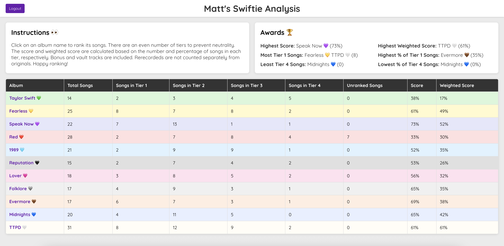
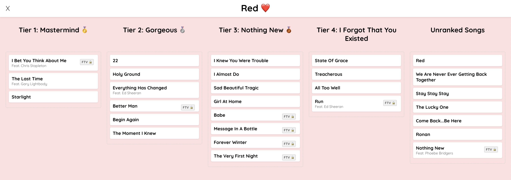

# Swiftie Song Analysis App

This app allows users to rank Taylor Swift songs from each of her albums to discover their favorite era! It features account creation as well as a drag and drop interface.




## Quickstart

For local development, ensure you've installed:
*   **Ruby:** Version 3.x (check `.ruby-version` in the `backend` directory for the exact version)
*   **Rails:** Version 7.x or 8.x
*   **Node.js:** Version 18.x or higher
*   **npm:** Version 8.x or higher

Then, open a terminal to run the Rails server:

```bash
# Navigate to the backend directory
cd swiftie-song-app/backend

# Install Ruby dependancies
bundle install

# Create and seed the SQLite database
rails db:create && rails db:migrate && rails db:seed

# Run on localhost, port 3001
rails server -p 3001
```

Finally, open a new terminal to run the React app:

```bash
# Navigate to the frontend directory
cd swiftie-song-app/frontend

# Install Node.js dependancies
npm install

# Run on localhost, port 3000
npm start -p 3000
```

**Important note**: While opening http://localhost.:3000 in your web browser is the same as http://127.0.0.1.:3000, the Spotify integration with OAuth 2.0 requires the latter.

## Development Plan

Generated with the help of Gemini CLI.

### **Phase 1: Backend App (Rails API)**

1.  **Project Setup:**
    * [x] Initialize a new Rails 7 application in API-only mode.
    * [x] Configure `CORS` (Cross-Origin Resource Sharing) to allow the React frontend to communicate with the API.

2.  **Database Modeling:**
    * [x] Create the necessary models and database migrations:
        * [x] `User`: To store name, email, and password digest.
        * [x] `Album`: To store title, release year, and colour.
        * [x] `Song`: To store title, album, Spotify track ID, featured artists, whether it's been re-recorded, and whether it's a Vault track.
        * [x] `Tier`: To store name, description, and value.
        * [x] `Ranking`: To store a user's chosen tier for a song.
    * [x] Create a seed file (`seeds.rb`) to populate the database with albums, songs, and tiers. 

3.  **API Endpoints:**
    * [x] Implement controllers and routes to expose the data:
        * [x] `GET /api/v1/tiers`: To list all tiers.
        * [x] `GET /api/v1/albums`: To list all albums.
        * [x] `GET /api/v1/albums/:id/songs`: To list all songs for a specific album.
        * [x] `POST /api/v1/rankings`: To create or update a user's rankings.
        * [x] `POST /register` and `POST /login` for user authentication. 

### **Phase 2: Frontend App (React)**

4.  **Project Setup:**
    * [x] Use `Create React App` to bootstrap a new React application.
    * [x] Install necessary libraries like `axios` for API calls and `react-router-dom` for navigation.

5.  **Drag-and-Drop Functionality:**
    * [x] Create basic UI components:
        * [x] `AlbumPage`: A page to fetch and display the ranked and unranked songs for a given album.
        * [x] `SongCard`: A draggable card representing a single song.
    * [x] Integrate a library like `react-beautiful-dnd` to enable dragging songs from a list and dropping them into the different tier components.
    * [x] When a user drops a song, update the component's state and send the new ranking to the Rails API.

### **Phase 3: Core Features**

6.  **User Authentication:**
    * [x] **Backend:** Implement token-based authentication using `has_secure_password` for password management and the `jwt` gem for token generation and validation.
    * [x] **Frontend:** Create Login and Signup pages. When a user logs in, store the received JWT (JSON Web Token) and include it in the header of all subsequent API requests.

7. **Album Scoring and Navigation:**
    * [x] **Backend:** Add a method or a service to calculate an album's score based on the `value` of each song's `tier` for a given user. Create endpoints for the frontend to fetch this.
    * [x] **Frontend:** Create a results page to display a user's album scores. Implement a menu for users to easily switch between this page and different album pages. Utilize `react-router-dom` to manage routing.

8. **Spotify Integration:**
    * [ ] **Backend:** Add the `rspotify` gem to handle OAuth authentication with Spotify. Create endpoints for the frontend to initiate the Spotify login flow.
    * [ ] **Frontend:** Add a "Connect to Spotify" button. Once authorized, use the Spotify Web Playback SDK to allow playback of 30-second song previews directly in the app. This will require storing the Spotify Track ID for each song in the database.

### **Phase 4: Deployment**

9.  **Backend Preparation:**
    * [ ] **Database:** Switch from SQLite to a production-ready database like PostgreSQL. This involves adding the `pg` gem to the `Gemfile` and updating `config/database.yml`.
    * [ ] **Environment Variables:** Ensure all secrets (API keys, database URL, `RAILS_MASTER_KEY`) are managed through environment variables and not hardcoded.
    * [ ] **CORS:** Update the CORS configuration in `config/initializers/cors.rb` to allow requests from the frontend's production domain.

10. **Frontend Preparation:**
    * [ ] **API URL:** Use an environment variable (e.g., `REACT_APP_API_URL`) to point to the deployed backend API, allowing the app to switch between `localhost` for development and the live URL for production.
    * [ ] **Build:** Create an optimized production build by running `npm run build`. This generates a `build` directory with static assets for deployment.

11. **Hosting:**
    * [ ] **Backend:** Deploy the Rails API to a Platform as a Service (PaaS) like **Render** or **Heroku**. Connect the service to the GitHub repository for automated builds and deployments. Then, run the database migrations on the production server (e.g. `bundle exec rails db:migrate`).
    * [ ] **Frontend:** Deploy the React app to a static hosting service like **Netlify** or **Vercel**. Connect the service to the GitHub repository and configure it to run the `npm run build` command.

## Decision Log

### Tech Stack

* **Backend**: I chose Ruby on Rails which is a robust and convention-over-configuration framework that accelerates API development. Its ActiveRecord ORM simplifies database interactions and the strong ecosystem of gems allows for rapid integration of core functionality.

* **Database**: I chose **SQLite** which is file-based, doesn't require a separate server process, and is most convenient for local development. Rails makes it easy to move to a more robust, client-server relational database management system like PostgreSQL or MySQL later if I wish to productionize the app.

* **API**: I chose a RESTful API for its simplicity, widespread adoption, and stateless nature which promotes scalability and clear separation between frontend / backend. Alternatives like GraphQL (more complex), SOAP (overly verbose), and RPC (less standardized) weren't suitable for this project's requirements.

* **Frontend**: I chose React which is a popular JavaScript library known for its component-based architecture, declarative views, and efficient rendering. This provides a strong foundation for building interactive and dynamic single-page applications.

### Database Denormalization: `album_id` on `Ranking` model

I decided to add an `album_id` column to the `Ranking` model even though this information could be derived through the `song_id` as each song belongs to an album. As a benefit, this allows for more efficient querying of user rankings per album and avoids costly `JOIN` operations with the `songs` table. As a trade off, this introduces a small amount of data redundancy but the risk of inconsistency is minimal given the stable relationship between songs and albums.

### User Authentication

I chose token-based authentication using Rails' built-in `has_secure_password` for password management and the `jwt` gem for JSON Web Token (JWT) generation and validation.
* It is a standard and secure practice for modern single-page applications and mobile clients.
* It is lightweight and API-centric unlike full-fledged authentication frameworks (e.g. Devise).
* It avoids the overhead of session management accross multiple servers which isn't necessary for a stateless API and lets it scale more easily.
* It promotes a clear separation of concerns with the backend handling authentication and the frontend storing and sending the JWT.

### Frontend Architecture

* The frontend was initialized with `Create React App` to provide a pre-configured build setup and testing environment without the need for manual Webpack configuration.
* State is managed locally using React Hooks (`useState`, `useEffect`, and custom hooks). This was chosen over a global state management library like Redux to maintain simplicity and a component-focused architecture given the application's current scale.
* API communication is handled by `axios`. It was chosen over the native `fetch` API for its ease of use, automatic JSON parsing, and convenient error handling capabilities.